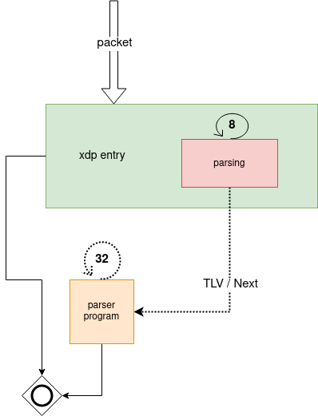

The XDP Target
================

The XDP2 compiler is able to generate code that runs on XDP.
The generated code uses the XDP2 parser framework as its building blocks,
while still complying to the BPF verifier.

Example XDP programs in XDP2 are located in [samples/xdp2](../samples/xdp). There
are four sample programs:

| Name | Directory | README |
|---|---|---|
| flow_tracker_simple | [samples/xdp/flow_tracker_simple](../samples/xdp/flow_tracker_simple) | [README.md](../samples/xdp/flow_tracker_simple/README.md)
| flow_tracker_tmpl | [samples/xdp/flow_tracker_tmpl](../samples/xdp/flow_tracker_tmpl) | [README.md](../samples/xdp/flow_tracker_tmpl/README.md)
| flow_tracker_tmpl | [samples/xdp/flow_tracker_tlvs](../samples/xdp/flow_tracker_tlvs) | [README.md](../samples/xdp/flow_tracker_tlvs/README.md)
| flow_tracker_tmpl | [samples/xdp/flow_tracker_combo](../samples/xdp/flow_tracker_combo) | [README.md](../samples/xdp/flow_tracker_combo/README.md)

Architecture
------------

The general arcuitecture of and XDP in XDP2 program is to split the program into two
parts: the frontend processing and the backend processing driven by the parser.



The architecture is split into two BPF programs, represented by the 'xdp entry' box
and the 'parser program' box.

'xdp entry' optimizes the common case, which is nodes without TLVs.

The code in this program parsers up to 8 nodes, handing over the
control to 'parser program' in case it didn't finish parsing or if it
encountered a node with TLVs.

Each dotted line represents a BPF tailcall, which is how we hand control
to 'parser program'.

A node that by the specification has TLVs (eg. TCP), but doesn't declare
them in the parser graph node, will not trigger this behaviour.
Nodes that come after a node with TLVs are always processed in 'parser program'.

In total, the current implementation, can parse up to 40 nodes.
Due to the restrictions imposed by the BPF verifier, it might not be always
possible to parse up to 8 nodes in 'xdp entry'.

# Building applications

In this section we build a simple flow tracker and explain how to integrate
XDP2 in your XDP application.

The flowtracker application described here can be built using the sources
[samples/xdp/flow_tracker_simple](../samples/xdp/flow_tracker_simple).


XDP2 Parser
-----------

Lets define a 5-tuple parser (from
[samples/xdp/flow_tracker_simple/parser.c](../samples/xdp/flow_tracker_simple/parser.c).
The parser will extract IPv4 source and destination, protocol and TCP ports.

```C
/* Parser for Ethernet, IPv4 and IPv6, and TCP and UDP. Do canned metadata
 * extraction for each node
 */

#include "common.h"

/* Meta data functions for parser nodes. Use the canned templates
 * for common metadata
 */

XDP2_METADATA_TEMP_ether(ether_metadata, xdp2_metadata_all)
XDP2_METADATA_TEMP_ipv4(ipv4_metadata, xdp2_metadata_all)
XDP2_METADATA_TEMP_ipv6(ipv6_metadata, xdp2_metadata_all)
XDP2_METADATA_TEMP_ports(ports_metadata, xdp2_metadata_all)

/* Parse nodes. Parse nodes are composed of the common XDP2 Parser protocol
 * nodes, metadata functions defined above, and protocol tables defined
 * below
 */

XDP2_MAKE_PARSE_NODE(ether_node, xdp2_parse_ether, ether_table,
                     (.ops.extract_metadata = ether_metadata));
XDP2_MAKE_PARSE_NODE(ip_check_node, xdp2_parse_ip, ip_check_table, ());
XDP2_MAKE_PARSE_NODE(ipv4_node, xdp2_parse_ipv4, ipv4_table,
                     (.ops.extract_metadata = ipv4_metadata));
XDP2_MAKE_LEAF_PARSE_NODE(ports_node, xdp2_parse_ports,
                          (.ops.extract_metadata = ports_metadata));

/* Protocol tables */

XDP2_MAKE_PROTO_TABLE(ether_table,
                      ( __cpu_to_be16(ETH_P_IP), ip_check_node )
);

XDP2_MAKE_PROTO_TABLE(ip_check_table,
                      ( 4, ipv4_node )
);

XDP2_MAKE_PROTO_TABLE(ipv4_table,
                      ( IPPROTO_TCP, ports_node ),
                      ( IPPROTO_UDP, ports_node )
);

XDP2_PARSER(xdp2_parser_simple_tuple, "XDP2 parser for 5 tuple TCP/UDP",
            ether_node,
            (.max_frames = 1,
             .metameta_size = 0,
             .frame_size = sizeof(struct xdp2_metadata_all)
            )
);

```

## Generating the Parser

The compiler will generate eBPF-C code when targeting XDP (replace *xdp2/install* with
the path for the appropriate directory.

```
$ ~/xdp2/install/bin/xdp2-compiler -I~/xdp2/install/include -i parser.c -o parser.xdp.h
```


The file `parser.xdp.h` contains the generated eBPF-C code.
The entry point function is `xdp2_parser_simple_tuple_xdp2_parse_ether_node`, in our case.

## Flow tracker

Lets create a toy flow tracker which store flows in a hash map.


In
[samples/xdp/flow_tracker_simple/flowtracker.h](../samples/xdp/flow_tracker_simple/flowtracker.h)
lets create flow tracker code as follows:

```C
#include <linux/bpf.h>
#include <bpf/bpf_helpers.h>

#include "xdp2/bpf.h"
#include "xdp2/parser_metadata.h"

struct flowtuple {
        __be32 saddr;
        __be32 daddr;
        __be16 sport;
        __be16 dport;
        __u8 protocol;
};

struct bpf_elf_map SEC("maps") flowtracker = {
        .type = BPF_MAP_TYPE_HASH,
        .size_key = sizeof(struct flowtuple),
        .size_value = sizeof(__u64),
        .max_elem = 32,
        .pinning = PIN_GLOBAL_NS,
};

/* Lookup a flow in the flow tracker map and increment counter on a hit */
static __always_inline void flow_track(struct xdp2_metadata_all *frame)
{
        struct flowtuple ft = {};
        __u64 new_counter = 1;
        __u64 *counter;

        /* is packet TCP? */
        if (frame->ip_proto != 6)
                return;

        ft.saddr = frame->addrs.v4.saddr;
        ft.daddr = frame->addrs.v4.daddr;
        ft.sport = frame->src_port;
        ft.dport = frame->dst_port;
        ft.protocol = frame->ip_proto;

        /* Looking for packets from source port 22 */
        if (ft.sport != htons(22))
                return;

        counter = bpf_map_lookup_elem(&flowtracker, &ft);
        if (counter) {
                __sync_fetch_and_add(counter, 1);
        } else {
                /* New flow entry */
                bpf_map_update_elem(&flowtracker, &ft, &new_counter,
                                    BPF_ANY);
        }
}

```

Note that a more robust implementation should handle the case where our map is full.

## XDP Integration

Parsing is done in two different BPF programs as described in Architecture.
In order to integrate the XDP2 parser in our application, we need to account
for BPF tail calls and context passing. The integration should look like the
following (from
[samples/xdp/flow_tracker_simple/flowtracker.h](../samples/xdp/flow_tracker_simple/flowtracker.h).

```C
#include <linux/bpf.h>
#include <bpf/bpf_helpers.h>

#include "common.h"
#include "flow_tracker.h"

#include "parser.xdp.h"

#define PROG_MAP_ID 0xcafe

struct bpf_elf_map SEC("maps") ctx_map = {
        .type = BPF_MAP_TYPE_PERCPU_ARRAY,
        .size_key = sizeof(__u32),
        .size_value = sizeof(struct flow_tracker_ctx),
        .max_elem = 2,
        .pinning = PIN_GLOBAL_NS,
};

struct bpf_elf_map SEC("maps") parsers = {
        .type = BPF_MAP_TYPE_PROG_ARRAY,
        .size_key = sizeof(__u32),
        .size_value = sizeof(__u32),
        .max_elem = 1,
        .pinning = PIN_GLOBAL_NS,
        .id = PROG_MAP_ID,
};

static __always_inline struct flow_tracker_ctx *xdp2_get_ctx(void)
{
        /* clang-10 has a bug if key == 0,
         * it generates bogus bytecodes.
         */
        __u32 key = 1;

        return bpf_map_lookup_elem(&ctx_map, &key);
}

SEC("0xcafe/0")
int parser_prog(struct xdp_md *ctx)
{
        struct flow_tracker_ctx *parser_ctx = xdp2_get_ctx();
        void *data_end = (void *)(long)ctx->data_end;
        const void *data = (void *)(long)ctx->data;
        const void *original = data;
        int rc = XDP2_OKAY;

        if (!parser_ctx)
                return XDP_ABORTED;

        /* Invoke XDP2 parser */
        rc = XDP2_PARSE_XDP(xdp2_parser_simple_tuple, &parser_ctx->ctx,
                            &data, data_end, false, 0);

        if (rc != XDP2_OKAY && rc != XDP2_STOP_OKAY) {
                bpf_xdp_adjust_head(ctx, -parser_ctx->ctx.offset);
                return XDP_PASS;
        }
        if (parser_ctx->ctx.next != CODE_IGNORE) {
                parser_ctx->ctx.offset += data - original;
                bpf_xdp_adjust_head(ctx, data - original);
                bpf_tail_call(ctx, &parsers, 0);
        }

        /* Call processing user function here */
        flow_track(parser_ctx->frame);
        bpf_xdp_adjust_head(ctx, -parser_ctx->ctx.offset);
        return XDP_PASS;
}

SEC("prog")
int xdp_prog(struct xdp_md *ctx)
{
        struct flow_tracker_ctx *parser_ctx = xdp2_get_ctx();
        void *data_end = (void *)(long)ctx->data_end;
        const void *data = (void *)(long)ctx->data;
        const void *original = data;
        int rc = XDP2_OKAY;

        if (!parser_ctx)
                return XDP_ABORTED;

        parser_ctx->ctx.frame_num = 0;
        parser_ctx->ctx.next = CODE_IGNORE;
        parser_ctx->ctx.metadata = parser_ctx->frame;
        parser_ctx->ctx.parser = xdp2_parser_simple_tuple;

        /* Invoke XDP2 parser */
        rc = XDP2_PARSE_XDP(xdp2_parser_simple_tuple, &parser_ctx->ctx,
                            &data, data_end, false, 0);

        if (rc != XDP2_OKAY && rc != XDP2_STOP_OKAY)
                return XDP_PASS;

        if (parser_ctx->ctx.next != CODE_IGNORE) {
                parser_ctx->ctx.offset = data - original;
                bpf_xdp_adjust_head(ctx, parser_ctx->ctx.offset);
                bpf_tail_call(ctx, &parsers, 0);
        }

        /* Call processing user function here */
        flow_track(parser_ctx->frame);

        return XDP_PASS;
}

char __license[] SEC("license") = "GPL";
```
We write the above code in `flow_tracker.bpf.c`.

## Verifying integration

Lets verify if everything works as expected in our flowtracker application.

```
Compile to BPF bytecode
-----------------------

```
# Compile the eBPF program:

$ clang -x c -g -O2 -c flow_tracker.bpf.c -I include/

# Then Load it

$ sudo ip link set dev lo xdp obj flow_tracker.xdp.o verbose
```

Where `<device>` is your network device (example `eno1` etc).

Note that `include/` points to XDP2's `include/` directory.

There are several ways to load a BPF program into XDP.
Using the `ip` program is just one of those ways.

After loading the program, we can then verify the implementation with `bpftool`.

```
$ bpftool map -f
7: hash  flags 0x0
        key 16B  value 8B  max_entries 32  memlock 4096B
        pinned /sys/fs/bpf/tc/globals/flowtracker
8: percpu_array  flags 0x0
        key 4B  value 224B  max_entries 2  memlock 8192B
        pinned /sys/fs/bpf/tc/globals/ctx_map
9: prog_array  flags 0x0
        key 4B  value 4B  max_entries 1  memlock 4096B
        owner_prog_type xdp  owner jited
        pinned /sys/fs/bpf/tc/globals/parsers

# After generating some TCP traffic...

$ sudo bpftool map dump id 7
key: 3f 74 f3 61 c0 a8 01 03  00 50 e5 c0 06 00 00 00  value: 4e 00 00 00 00 00 00 00
Found 1 element
```

The key is the memory dump of our `struct flowtuple` tuple and the
value is the memory dump of our `__u64` counter.

# Unloading

Unload the binary.

**sudo ip link set dev \<device\> xdp off**

Remove the BPF maps.

**sudo rm -rfv /sys/fs/bpf/tc/globals**
